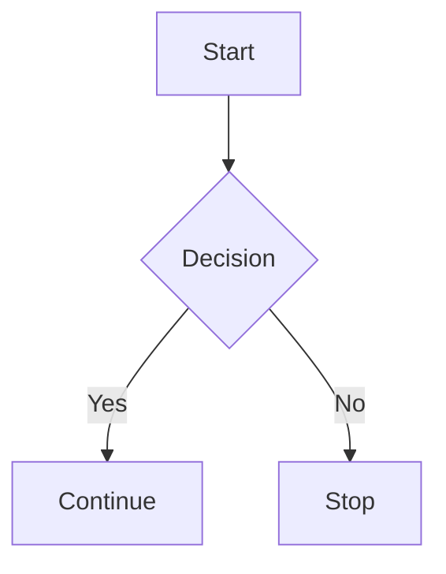

# Components & Feature Showcase

This page demonstrates major Zensical features enabled in your configuration.

---

## 📘 Admonitions

!!! note
    This is a **note** block.

!!! warning
    This is a **warning** block.

!!! info
    This is an **info** block.

!!! tip
    This is a **tip** block.

---

## 🧩 Tabs

=== "Python"

    ```python
    print("Hello from Python")
    ```

=== "JavaScript"

    ```javascript
    console.log("Hello from JavaScript")
    ```

=== "C#"

    ```csharp
    Console.WriteLine("Hello from C#");
    ```

---

## 🧠 Tooltips

Hover over this link:  
[Zensical](https://zensical.org "Zensical Documentation")

---

## 📌 Task List

- [x] Create project  
- [x] Add pages  
- [ ] Deploy site  

---

## 📊 Mermaid Diagram



---

## 💡 Code Blocks with Highlighting

```python
def greet(name):
    # This line will be highlighted by the theme
    return f"Hello, {name}!"
```

---

## 📝 Footnotes

Here is a sentence with a footnote.[^1]

[^1]: This is the footnote content.

---

## 🔤 Abbreviations

The HTML spec is maintained by the W3C.

*[HTML]: HyperText Markup Language  
*[W3C]: World Wide Web Consortium

---

## 📚 Definition Lists

Term 1  
: Definition for term 1

Term 2  
: Definition for term 2

---

## 🎛 Details / Expanders

<details>
<summary>Click to expand</summary>

This is hidden content revealed using the **details** extension.

</details>

---

## 🎨 Marking / Highlighting

This is ==highlighted text== using `pymdownx.mark`.

---

## 🎹 Keyboard Keys

Press ++ctrl+shift+p++ to open the command palette. 

---

## ✨ Emojis

:smile: :rocket: :tada:

---

## 🔀 Smart Symbols

(c) → ©  
(tm) → ™  
(1/2) → ½

---

## 🧱 Superfences

```html
<div>
    <pre>
        <code>
            Nested code block example
        </code>
    </pre>
</div>
```

---

## 🧪 Combined Example

!!! note
    Here is a combined example with **math**, a tooltip, and a footnote.[^2]

    Inline math: \( e^{i\pi} + 1 = 0 \)

    Tooltip: [Hover me](https://example.com "Tooltip text")

[^2]: Footnote inside an admonition.
