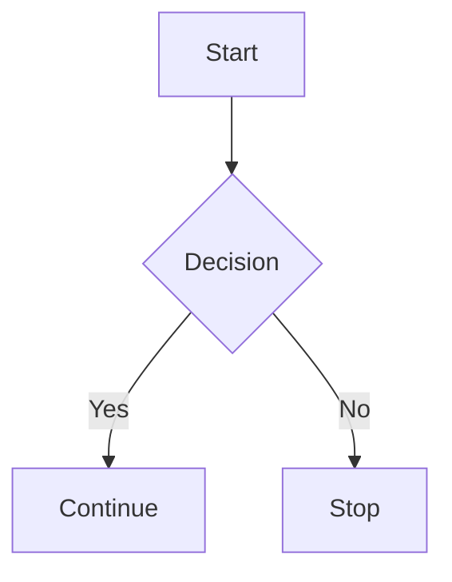

# Demo Components

This page demonstrates some of the enhanced Markdown features available in Zensical.

---

## 📘 Admonitions

!!! note
    This is a **note** block.

!!! warning
    This is a **warning** block.

!!! info
    This is an **info** block.

---

## 🧩 Tabs

=== "Python"

    ```python
    print("Hello from Python")
    ```

=== "JavaScript"

    ```javascript
    console.log("Hello from JavaScript")
    ```

=== "C#"

    ```csharp
    Console.WriteLine("Hello from C#");
    ```

---

## 🧠 Tooltips

Hover over this link to see a tooltip:  
[Zensical](https://zensical.org "Zensical Documentation")

---

## 📌 Task List

- [x] Create project  
- [x] Add pages  
- [ ] Deploy site  

---

## 📊 Mermaid Diagram


