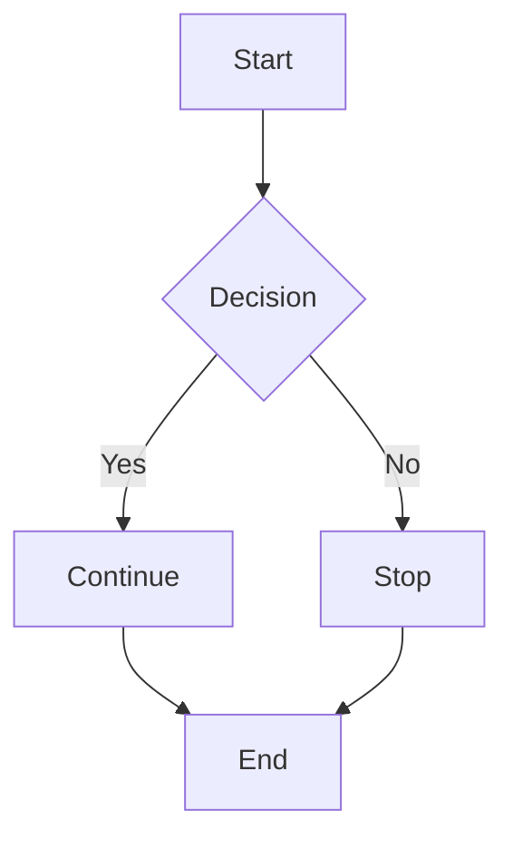

# Components & Feature Showcase

This page demonstrates major Zensical features enabled in your configuration.

---

## 📘 Admonitions

!!! note
    This is a **note** block. Use it for additional information.

!!! warning
    This is a **warning** block. Use it for important notices.

!!! info
    This is an **info** block. Use it for informational content.

!!! tip
    This is a **tip** block. Use it for helpful suggestions.

!!! success
    This is a **success** block. Use it for positive outcomes.

!!! danger
    This is a **danger** block. Use it for critical information.

---

## 🧩 Tabs

=== "Python"

    ```python
    def hello():
        print("Hello from Python!")
    
    hello()
    ```

=== "JavaScript"

    ```javascript
    function hello() {
        console.log("Hello from JavaScript!");
    }
    
    hello();
    ```

=== "C#"

    ```csharp
    public static void Main()
    {
        Console.WriteLine("Hello from C#!");
    }
    ```

=== "Bash"

    ```bash
    #!/bin/bash
    echo "Hello from Bash!"
    ```

---

## 🧠 Tooltips

Hover over this link for more info:  
[Zensical Documentation](https://zensical.org "Open Zensical Official Docs")

---

## 📌 Task List

- [x] Create project  
- [x] Add pages  
- [ ] Deploy site  
- [ ] Set up analytics

---

## 📊 Mermaid Diagram



---

## 💡 Code Highlighting

=== "Python with highlighting"

    ```python hl_lines="2"
    def greet(name):
        return f"Hello, {name}!"  # This line is highlighted
    
    print(greet("World"))
    ```

=== "JavaScript with annotations"

    ```javascript
    function calculate(a, b) {
        return a + b;  // (1)!
    }
    
    // (1) This returns the sum of two numbers
    ```

---

## 📝 Footnotes

Here is a sentence with a footnote.[^1] And here's another one.[^2]

[^1]: This is the first footnote content.
[^2]: This is the second footnote content.

---

## 🔤 Abbreviations

The HTML spec is maintained by the W3C.

*[HTML]: HyperText Markup Language  
*[W3C]: World Wide Web Consortium

---

## 📐 Mathematical Formulas

Inline math: $E=mc^2$

Block math:

$$
E = mc^2
$$

---

**Learn more:**
- [Features Overview](index.md)
- [Markdown Examples](markdown.md)
